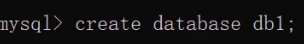
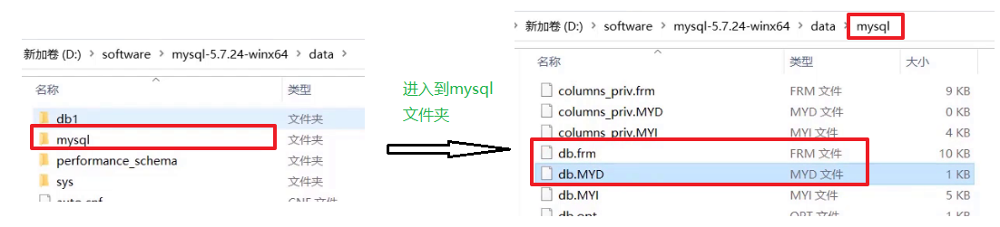
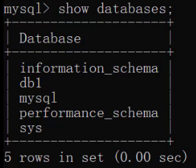

# JavaWeb
JavaWeb学习

# javaWeb介绍

1. 网页:展现数据
2. 数据库:存储和管理数据
3. JavaWeb程序:逻辑处理

# MySQL数据模型


**关系型数据库：**

> 关系型数据库是建立在关系模型基础上的数据库，简单说，关系型数据库是由多张能互相连接的 二维表 组成的数据库

如下图，`订单信息表` 和 `客户信息表` 都是有行有列二维表我们将这样的称为关系型数据库。


接下来看关系型数据库的优点：

* 都是使用表结构，格式一致，易于维护。
* 使用通用的 SQL 语言操作，使用方便，可用于复杂查询。
  * 关系型数据库都可以通过SQL进行操作，所以使用方便。
  * 复杂查询。现在需要查询001号订单数据，我们可以看到该订单是1号客户的订单，而1号订单是李聪这个客户。以后也可以在一张表中进行统计分析等操作。
* 数据存储在磁盘中，安全。

**数据模型：**


如上图，我们通过客户端可以通过数据库管理系统创建数据库，在数据库中创建表，在表中添加数据。创建的每一个数据库对应到磁盘上都是一个文件夹。比如可以通过SQL语句创建一个数据库（数据库名称为db1），语句如下。该语句咱们后面会学习。



我们可以在数据库安装目录下的data目录下看到多了一个 `db1` 的文件夹。所以，**在MySQL中一个数据库对应到磁盘上的一个文件夹。**

而一个数据库下可以创建多张表，我们到MySQL中自带的mysql数据库的文件夹目录下：



而上图中右边的 `db.frm` 是表文件，`db.MYD` 是数据文件，通过这两个文件就可以查询到数据展示成二维表的效果。

**小结：**
* MySQL中可以创建多个数据库，每个数据库对应到磁盘上的一个文件夹
* 在每个数据库中可以创建多个表，每张都对应到磁盘上一个 frm 文件
* 每张表可以存储多条数据，数据会被存储到磁盘中  MYD 文件中

## SQL概述
了解了数据模型后，接下来我们就学习SQL语句，通过SQL语句对数据库、表、数据进行增删改查操作。 

## SQL简介
* 英文：Structured Query Language，简称 SQL
* 结构化查询语言，一门操作关系型数据库的编程语言
* 定义操作所有关系型数据库的统一标准
* 对于同一个需求，每一种数据库操作的方式可能会存在一些不一样的地方，我们称为“方言”

### 通用语法

* SQL 语句可以单行或多行书写，以分号结尾。

   
  
  如上，以分号结尾才是一个完整的sql语句。
* MySQL 数据库的 SQL 语句不区分大小写，关键字建议使用大写。

  同样的一条sql语句写成下图的样子，一样可以运行处结果。
  
   
  
* 注释
  * 单行注释: -- 注释内容 或 #注释内容(MySQL 特有) 
  
     
    
     
    
    > 注意：使用-- 添加单行注释时，--后面一定要加空格，而#没有要求。
  * 多行注释: /* 注释 */
## SQL分类
* DDL(Data Definition Language) ： 数据定义语言，用来定义数据库对象：数据库，表，列等
  DDL简单理解就是用来操作数据库，表等
  
  
  
* DML(Data Manipulation Language) 数据操作语言，用来对数据库中表的数据进行增删改

  DML简单理解就对表中数据进行增删改
  
  
  
* DQL(Data Query Language) 数据查询语言，用来查询数据库中表的记录(数据)

  DQL简单理解就是对数据进行查询操作。从数据库表中查询到我们想要的数据。
  
* DCL(Data Control Language) 数据控制语言，用来定义数据库的访问权限和安全级别，及创建用户

  DML简单理解就是对数据库进行权限控制。比如我让某一个数据库表只能让某一个用户进行操作等。
  
> 注意： 以后我们最常操作的是 `DML` 和 `DQL`  ，因为我们开发中最常操作的就是数据。

## DDL:操作数据库

我们先来学习DDL来操作数据库。而操作数据库主要就是对数据库的增删查操作。

### 查询

查询所有的数据库

```sql
SHOW DATABASES;
```
运行上面语句效果如下：


上述查询到的是的这些数据库是mysql安装好自带的数据库，我们以后不要操作这些数据库。

### 创建数据库

* **创建数据库**：

```sql
CREATE DATABASE 数据库名称;
```
运行语句效果如下：


而在创建数据库的时候，我并不知道db1数据库有没有创建，直接再次创建名为db1的数据库就会出现错误。


为了避免上面的错误，在创建数据库的时候先做判断，如果不存在再创建。

* **创建数据库(判断，如果不存在则创建)**
```sql
CREATE DATABASE IF NOT EXISTS 数据库名称;
```
运行语句效果如下：


从上面的效果可以看到虽然db1数据库已经存在，再创建db1也没有报错，而创建db2数据库则创建成功。
###  删除数据库
* **删除数据库**
```sql
DROP DATABASE 数据库名称;
```
* **删除数据库(判断，如果存在则删除)**
```sql
DROP DATABASE IF EXISTS 数据库名称;
```
运行语句效果如下：


### 使用数据库

数据库创建好了，要在数据库中创建表，得先明确在哪儿个数据库中操作，此时就需要使用数据库。

* **使用数据库**

```sql
USE 数据库名称;
```

* **查看当前使用的数据库**

```sql
SELECT DATABASE();
```

运行语句效果如下：


## DDL:操作表

操作表也就是对表进行增（Create）删（Retrieve）改（Update）查（Delete）。

### 查询表

* **查询当前数据库下所有表名称**

```sql
SHOW TABLES;
```

我们创建的数据库中没有任何表，因此我们进入mysql自带的mysql数据库，执行上述语句查看


* **查询表结构**

```sql
DESC 表名称;
```

查看mysql数据库中func表的结构，运行语句如下：


### 5.2  创建表

* **创建表**

```sql
CREATE TABLE 表名 (
	字段名1  数据类型1,
	字段名2  数据类型2,
	…
	字段名n  数据类型n
);
```

> 注意：最后一行末尾，不能加逗号

知道了创建表的语句，那么我们创建创建如下结构的表


```sql
create table tb_user (
	id int,
    username varchar(20),
    password varchar(32)
);
```

运行语句如下：


### 5.3  数据类型

MySQL 支持多种类型，可以分为三类：

* 数值

  ```sql
  tinyint : 小整数型，占一个字节
  int	： 大整数类型，占四个字节
  	eg ： age int
  double ： 浮点类型
  	使用格式： 字段名 double(总长度,小数点后保留的位数)
  	eg ： score double(5,2)   
  ```
  
* 日期

  ```sql
  date ： 日期值。只包含年月日
  	eg ：birthday date ： 
  datetime ： 混合日期和时间值。包含年月日时分秒
  ```
  
* 字符串

  ```sql
  char ： 定长字符串。
  	优点：存储性能高
  	缺点：浪费空间
  	eg ： name char(10)  如果存储的数据字符个数不足10个，也会占10个的空间
  varchar ： 变长字符串。
  	优点：节约空间
  	缺点：存储性能底
  	eg ： name varchar(10) 如果存储的数据字符个数不足10个，那就数据字符个数是几就占几个的空间	
  ```
  
> 注意：其他类型参考资料中的《MySQL数据类型].xlsx》

**案例：**

```
需求：设计一张学生表，请注重数据类型、长度的合理性
	1. 编号
	2. 姓名，姓名最长不超过10个汉字
	3. 性别，因为取值只有两种可能，因此最多一个汉字
	4. 生日，取值为年月日
	5. 入学成绩，小数点后保留两位
	6. 邮件地址，最大长度不超过 64
	7. 家庭联系电话，不一定是手机号码，可能会出现 - 等字符
	8. 学生状态（用数字表示，正常、休学、毕业...）
```

语句设计如下：

```sql
create table student (
	id int,
    name varchar(10),
    gender char(1),
    birthday date,
    score double(5,2),
    email varchar(15),
    tel varchar(15),
    status tinyint
);
```

### 5.4  删除表

* **删除表**

```sql
DROP TABLE 表名;
```

* **删除表时判断表是否存在**

```sql
DROP TABLE IF EXISTS 表名;
```

运行语句效果如下：


### 5.5  修改表

* **修改表名**

```sql
ALTER TABLE 表名 RENAME TO 新的表名;
-- 将表名student修改为stu
alter table student rename to stu;
```

* **添加一列**

```sql
ALTER TABLE 表名 ADD 列名 数据类型;
-- 给stu表添加一列address，该字段类型是varchar(50)
alter table stu add address varchar(50);
```

* **修改数据类型**

```sql
ALTER TABLE 表名 MODIFY 列名 新数据类型;
-- 将stu表中的address字段的类型改为 char(50)
alter table stu modify address char(50);
```

* **修改列名和数据类型**

```sql
ALTER TABLE 表名 CHANGE 列名 新列名 新数据类型;
-- 将stu表中的address字段名改为 addr，类型改为varchar(50)
alter table stu change address addr varchar(50);
```

* **删除列**

```sql
ALTER TABLE 表名 DROP 列名;
-- 将stu表中的addr字段 删除
alter table stu drop addr;
```


