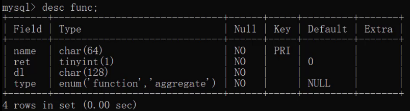
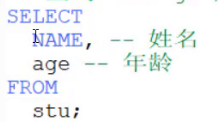

# JavaWeb
JavaWeb学习

# javaWeb介绍

1. 网页:展现数据
2. 数据库:存储和管理数据
3. JavaWeb程序:逻辑处理

# MySQL数据模型


**关系型数据库：**

> 关系型数据库是建立在关系模型基础上的数据库，简单说，关系型数据库是由多张能互相连接的 二维表 组成的数据库

如下图，`订单信息表` 和 `客户信息表` 都是有行有列二维表我们将这样的称为关系型数据库。


接下来看关系型数据库的优点：

* 都是使用表结构，格式一致，易于维护。
* 使用通用的 SQL 语言操作，使用方便，可用于复杂查询。
  * 关系型数据库都可以通过SQL进行操作，所以使用方便。
  * 复杂查询。现在需要查询001号订单数据，我们可以看到该订单是1号客户的订单，而1号订单是李聪这个客户。以后也可以在一张表中进行统计分析等操作。
* 数据存储在磁盘中，安全。

**数据模型：**


如上图，我们通过客户端可以通过数据库管理系统创建数据库，在数据库中创建表，在表中添加数据。创建的每一个数据库对应到磁盘上都是一个文件夹。比如可以通过SQL语句创建一个数据库（数据库名称为db1），语句如下。该语句咱们后面会学习。


我们可以在数据库安装目录下的data目录下看到多了一个 `db1` 的文件夹。所以，**在MySQL中一个数据库对应到磁盘上的一个文件夹。**

而一个数据库下可以创建多张表，我们到MySQL中自带的mysql数据库的文件夹目录下：


而上图中右边的 `db.frm` 是表文件，`db.MYD` 是数据文件，通过这两个文件就可以查询到数据展示成二维表的效果。

**小结：**
* MySQL中可以创建多个数据库，每个数据库对应到磁盘上的一个文件夹
* 在每个数据库中可以创建多个表，每张都对应到磁盘上一个 frm 文件
* 每张表可以存储多条数据，数据会被存储到磁盘中  MYD 文件中

## SQL概述
了解了数据模型后，接下来我们就学习SQL语句，通过SQL语句对数据库、表、数据进行增删改查操作。 

## SQL简介
* 英文：Structured Query Language，简称 SQL
* 结构化查询语言，一门操作关系型数据库的编程语言
* 定义操作所有关系型数据库的统一标准
* 对于同一个需求，每一种数据库操作的方式可能会存在一些不一样的地方，我们称为“方言”

### 通用语法

* SQL 语句可以单行或多行书写，以分号结尾。

   
  
  如上，以分号结尾才是一个完整的sql语句。
* MySQL 数据库的 SQL 语句不区分大小写，关键字建议使用大写。

  同样的一条sql语句写成下图的样子，一样可以运行处结果。
  
   
  
* 注释
  * 单行注释: -- 注释内容 或 #注释内容(MySQL 特有) 
  
     
    
     
    
    > 注意：使用-- 添加单行注释时，--后面一定要加空格，而#没有要求。
  * 多行注释: /* 注释 */
## SQL分类
* DDL(Data Definition Language) ： 数据定义语言，用来定义数据库对象：数据库，表，列等
  DDL简单理解就是用来操作数据库，表等
  
  
  
* DML(Data Manipulation Language) 数据操作语言，用来对数据库中表的数据进行增删改

  DML简单理解就对表中数据进行增删改
  
  
  
* DQL(Data Query Language) 数据查询语言，用来查询数据库中表的记录(数据)

  DQL简单理解就是对数据进行查询操作。从数据库表中查询到我们想要的数据。
  
* DCL(Data Control Language) 数据控制语言，用来定义数据库的访问权限和安全级别，及创建用户

  DML简单理解就是对数据库进行权限控制。比如我让某一个数据库表只能让某一个用户进行操作等。
  
> 注意： 以后我们最常操作的是 `DML` 和 `DQL`  ，因为我们开发中最常操作的就是数据。

## DDL:操作数据库

我们先来学习DDL来操作数据库。而操作数据库主要就是对数据库的增删查操作。

### 查询

查询所有的数据库

```sql
SHOW DATABASES;
```
运行上面语句效果如下：


上述查询到的是的这些数据库是mysql安装好自带的数据库，我们以后不要操作这些数据库。

### 创建数据库

* **创建数据库**：

```sql
CREATE DATABASE 数据库名称;
```
运行语句效果如下：


而在创建数据库的时候，我并不知道db1数据库有没有创建，直接再次创建名为db1的数据库就会出现错误。


为了避免上面的错误，在创建数据库的时候先做判断，如果不存在再创建。

* **创建数据库(判断，如果不存在则创建)**
```sql
CREATE DATABASE IF NOT EXISTS 数据库名称;
```
运行语句效果如下：


从上面的效果可以看到虽然db1数据库已经存在，再创建db1也没有报错，而创建db2数据库则创建成功。
###  删除数据库
* **删除数据库**
```sql
DROP DATABASE 数据库名称;
```
* **删除数据库(判断，如果存在则删除)**
```sql
DROP DATABASE IF EXISTS 数据库名称;
```
运行语句效果如下：


### 使用数据库

数据库创建好了，要在数据库中创建表，得先明确在哪儿个数据库中操作，此时就需要使用数据库。

* **使用数据库**

```sql
USE 数据库名称;
```

* **查看当前使用的数据库**

```sql
SELECT DATABASE();
```

运行语句效果如下：


## DDL:操作表

操作表也就是对表进行增（Create）删（Retrieve）改（Update）查（Delete）。

### 查询表

* **查询当前数据库下所有表名称**

```sql
SHOW TABLES;
```

我们创建的数据库中没有任何表，因此我们进入mysql自带的mysql数据库，执行上述语句查看


* **查询表结构**

```sql
DESC 表名称;
```

查看mysql数据库中func表的结构，运行语句如下：



### 创建表

* **创建表**

```sql
CREATE TABLE 表名 (
	字段名1  数据类型1,
	字段名2  数据类型2,
	…
	字段名n  数据类型n
);
```

> 注意：最后一行末尾，不能加逗号

知道了创建表的语句，那么我们创建创建如下结构的表

```sql
create table tb_user (
	id int,
    username varchar(20),
    password varchar(32)
);
```

运行语句如下：


### 数据类型

MySQL 支持多种类型，可以分为三类：


* 数值

  ```sql
  tinyint : 小整数型，占一个字节
  int	： 大整数类型，占四个字节
  	eg ： age int
  double ： 浮点类型
  	使用格式： 字段名 double(总长度,小数点后保留的位数)
  	eg ： score double(5,2)   
  ```
  
* 日期

  ```sql
  date ： 日期值。只包含年月日
  	eg ：birthday date ： 
  datetime ： 混合日期和时间值。包含年月日时分秒
  ```
  
* 字符串

  ```sql
  char ： 定长字符串。
  	优点：存储性能高
  	缺点：浪费空间
  	eg ： name char(10)  如果存储的数据字符个数不足10个，也会占10个的空间
  varchar ： 变长字符串。
  	优点：节约空间
  	缺点：存储性能底
  	eg ： name varchar(10) 如果存储的数据字符个数不足10个，那就数据字符个数是几就占几个的空间	
  ```
  
> 注意：其他类型参考资料中的《MySQL数据类型].xlsx》

**案例：**

```
需求：设计一张学生表，请注重数据类型、长度的合理性
	1. 编号
	2. 姓名，姓名最长不超过10个汉字
	3. 性别，因为取值只有两种可能，因此最多一个汉字
	4. 生日，取值为年月日
	5. 入学成绩，小数点后保留两位
	6. 邮件地址，最大长度不超过 64
	7. 家庭联系电话，不一定是手机号码，可能会出现 - 等字符
	8. 学生状态（用数字表示，正常、休学、毕业...）
```

语句设计如下：

```sql
create table student (
	id int,
    name varchar(10),
    gender char(1),
    birthday date,
    score double(5,2),
    email varchar(15),
    tel varchar(15),
    status tinyint
);
```

### 删除表

* **删除表**

```sql
DROP TABLE 表名;
```

* **删除表时判断表是否存在**

```sql
DROP TABLE IF EXISTS 表名;
```

运行语句效果如下：


### 修改表

* **修改表名**

```sql
ALTER TABLE 表名 RENAME TO 新的表名;
-- 将表名student修改为stu
alter table student rename to stu;
```

* **添加一列**

```sql
ALTER TABLE 表名 ADD 列名 数据类型;
-- 给stu表添加一列address，该字段类型是varchar(50)
alter table stu add address varchar(50);
```

* **修改数据类型**

```sql
ALTER TABLE 表名 MODIFY 列名 新数据类型;
-- 将stu表中的address字段的类型改为 char(50)
alter table stu modify address char(50);
```

* **修改列名和数据类型**

```sql
ALTER TABLE 表名 CHANGE 列名 新列名 新数据类型;
-- 将stu表中的address字段名改为 addr，类型改为varchar(50)
alter table stu change address addr varchar(50);
```

* **删除列**

```sql
ALTER TABLE 表名 DROP 列名;
-- 将stu表中的addr字段 删除
alter table stu drop addr;
```


## DQL

下面是黑马程序员展示试题库数据的页面


页面上展示的数据肯定是在数据库中的试题库表中进行存储，而我们需要将数据库中的数据查询出来并展示在页面给用户看。上图中的是最基本的查询效果，那么数据库其实是很多的，不可能在将所有的数据在一页进行全部展示，而页面上会有分页展示的效果，如下：


当然上图中的难度字段当我们点击也可以实现排序查询操作。从这个例子我们就可以看出，对于数据库的查询时灵活多变的，需要根据具体的需求来实现，而数据库查询操作也是最重要的操作，所以此部分需要大家重点掌握。

接下来我们先介绍查询的完整语法：

```sql
SELECT 
    字段列表
FROM 
    表名列表 
WHERE 
    条件列表
GROUP BY
    分组字段
HAVING
    分组后条件
ORDER BY
    排序字段
LIMIT
    分页限定
```

为了给大家演示查询的语句，我们需要先准备表及一些数据：

```sql
-- 删除stu表
drop table if exists stu;


-- 创建stu表
CREATE TABLE stu (
 id int, -- 编号
 name varchar(20), -- 姓名
 age int, -- 年龄
 sex varchar(5), -- 性别
 address varchar(100), -- 地址
 math double(5,2), -- 数学成绩
 english double(5,2), -- 英语成绩
 hire_date date -- 入学时间
);

-- 添加数据
INSERT INTO stu(id,NAME,age,sex,address,math,english,hire_date) 
VALUES 
(1,'马运',55,'男','杭州',66,78,'1995-09-01'),
(2,'马花疼',45,'女','深圳',98,87,'1998-09-01'),
(3,'马斯克',55,'男','香港',56,77,'1999-09-02'),
(4,'柳白',20,'女','湖南',76,65,'1997-09-05'),
(5,'柳青',20,'男','湖南',86,NULL,'1998-09-01'),
(6,'刘德花',57,'男','香港',99,99,'1998-09-01'),
(7,'张学右',22,'女','香港',99,99,'1998-09-01'),
(8,'德玛西亚',18,'男','南京',56,65,'1994-09-02');
```

接下来咱们从最基本的查询语句开始学起。

### 基础查询

####  语法

* **查询多个字段**

```sql
SELECT 字段列表 FROM 表名;
SELECT * FROM 表名; -- 查询所有数据
```

* **去除重复记录**

```sql
SELECT DISTINCT 字段列表 FROM 表名;
```

* **起别名**

```sql
AS: AS 也可以省略
```


#### 练习

* 查询name、age两列

  ```sql
  select name,age from stu;
  ```

* 查询所有列的数据，列名的列表可以使用*替代

  ```sql
  select * from stu;
  ```

  上面语句中的\*不建议大家使用，因为在这写\*不方便我们阅读sql语句。我们写字段列表的话，可以添加注释对每一个字段进行说明

  

  而在上课期间为了简约课程的时间，老师很多地方都会写*。

* 查询地址信息

  ```sql
  select address from stu;
  ```

  执行上面语句结果如下：

  

  从上面的结果我们可以看到有重复的数据，我们也可以使用 `distinct` 关键字去重重复数据。

* 去除重复记录

  ```sql
  select distinct address from stu;
  ```

* 查询姓名、数学成绩、英语成绩。并通过as给math和english起别名（as关键字可以省略）

  ```sql
  select name,math as 数学成绩,english as 英文成绩 from stu;
  select name,math 数学成绩,english 英文成绩 from stu;
  ```

  

### 条件查询

#### 语法

```sql
SELECT 字段列表 FROM 表名 WHERE 条件列表;
```

* **条件**

条件列表可以使用以下运算符


#### 条件查询练习

* 查询年龄大于20岁的学员信息

  ```sql
  select * from stu where age > 20;
  ```

* 查询年龄大于等于20岁的学员信息

  ```sql
  select * from stu where age >= 20;
  ```

* 查询年龄大于等于20岁 并且 年龄 小于等于 30岁 的学员信息

  ```sql
  select * from stu where age >= 20 &&  age <= 30;
  select * from stu where age >= 20 and  age <= 30;
  ```

  > 上面语句中 &&  和  and  都表示并且的意思。建议使用 and 。
  >
  > 也可以使用  between ... and 来实现上面需求

  ```sql
  select * from stu where age BETWEEN 20 and 30;
  ```

* 查询入学日期在'1998-09-01' 到 '1999-09-01'  之间的学员信息

  ```sql
  select * from stu where hire_date BETWEEN '1998-09-01' and '1999-09-01';
  ```

* 查询年龄等于18岁的学员信息

  ```sql
  select * from stu where age = 18;
  ```

* 查询年龄不等于18岁的学员信息

  ```sql
  select * from stu where age != 18;
  select * from stu where age <> 18;
  ```

* 查询年龄等于18岁 或者 年龄等于20岁 或者 年龄等于22岁的学员信息

  ```sql
  select * from stu where age = 18 or age = 20 or age = 22;
  select * from stu where age in (18,20 ,22);
  ```

* 查询英语成绩为 null的学员信息

  null值的比较不能使用 =  或者 != 。需要使用 is  或者 is not

  ```sql
  select * from stu where english = null; -- 这个语句是不行的
  select * from stu where english is null;
  select * from stu where english is not null;
  ```

#### 模糊查询练习

> 模糊查询使用like关键字，可以使用通配符进行占位:
>
> （1）_ : 代表单个任意字符
>
> （2）% : 代表任意个数字符

* 查询姓'马'的学员信息

  ```sql
  select * from stu where name like '马%';
  ```

* 查询第二个字是'花'的学员信息  

  ```sql
  select * from stu where name like '_花%';
  ```

* 查询名字中包含 '德' 的学员信息

  ```sql
  select * from stu where name like '%德%';
  ```

  

### 排序查询

#### 语法

```sql
SELECT 字段列表 FROM 表名 ORDER BY 排序字段名1 [排序方式1],排序字段名2 [排序方式2] …;
```

上述语句中的排序方式有两种，分别是：

* ASC ： 升序排列 **（默认值）**
* DESC ： 降序排列

> 注意：如果有多个排序条件，当前边的条件值一样时，才会根据第二条件进行排序


#### 练习

* 查询学生信息，按照年龄升序排列 

  ```sql
  select * from stu order by age ;
  ```

* 查询学生信息，按照数学成绩降序排列

  ```sql
  select * from stu order by math desc ;
  ```

* 查询学生信息，按照数学成绩降序排列，如果数学成绩一样，再按照英语成绩升序排列

  ```sql
  select * from stu order by math desc , english asc ;
  ```

  

### 聚合函数

#### 概念

 ==将一列数据作为一个整体，进行纵向计算。==

如何理解呢？假设有如下表


现有一需求让我们求表中所有数据的数学成绩的总和。这就是对math字段进行纵向求和。

#### 聚合函数分类

| 函数名      | 功能                             |
| ----------- | -------------------------------- |
| count(列名) | 统计数量（一般选用不为null的列） |
| max(列名)   | 最大值                           |
| min(列名)   | 最小值                           |
| sum(列名)   | 求和                             |
| avg(列名)   | 平均值                           |

#### 聚合函数语法

```sql
SELECT 聚合函数名(列名) FROM 表;
```

> 注意：null 值不参与所有聚合函数运算


#### 练习

* 统计班级一共有多少个学生

  ```sql
  select count(id) from stu;
  select count(english) from stu;
  ```

  上面语句根据某个字段进行统计，如果该字段某一行的值为null的话，将不会被统计。所以可以在count(*) 来实现。\* 表示所有字段数据，一行中也不可能所有的数据都为null，所以建议使用 count(\*)

  ```sql
  select count(*) from stu;
  ```

* 查询数学成绩的最高分

  ```sql
  select max(math) from stu;
  ```

* 查询数学成绩的最低分

  ```sql
  select min(math) from stu;
  ```

* 查询数学成绩的总分

  ```sql
  select sum(math) from stu;
  ```

* 查询数学成绩的平均分

  ```sql
  select avg(math) from stu;
  ```

* 查询英语成绩的最低分

  ```sql
  select min(english) from stu;
  ```

  

### 分组查询

####  语法

```sql
SELECT 字段列表 FROM 表名 [WHERE 分组前条件限定] GROUP BY 分组字段名 [HAVING 分组后条件过滤];
```

> 注意：分组之后，查询的字段为聚合函数和分组字段，查询其他字段无任何意义


####  练习

* 查询男同学和女同学各自的数学平均分

  ```sql
  select sex, avg(math) from stu group by sex;
  ```

  > 注意：分组之后，查询的字段为聚合函数和分组字段，查询其他字段无任何意义

  ```sql
  select name, sex, avg(math) from stu group by sex;  -- 这里查询name字段就没有任何意义
  ```

* 查询男同学和女同学各自的数学平均分，以及各自人数

  ```sql
  select sex, avg(math),count(*) from stu group by sex;
  ```

* 查询男同学和女同学各自的数学平均分，以及各自人数，要求：分数低于70分的不参与分组

  ```sql
  select sex, avg(math),count(*) from stu where math > 70 group by sex;
  ```

* 查询男同学和女同学各自的数学平均分，以及各自人数，要求：分数低于70分的不参与分组，分组之后人数大于2个的

  ```sql
  select sex, avg(math),count(*) from stu where math > 70 group by sex having count(*)  > 2;
  ```

  

**where 和 having 区别：**

* 执行时机不一样：where 是分组之前进行限定，不满足where条件，则不参与分组，而having是分组之后对结果进行过滤。

* 可判断的条件不一样：where 不能对聚合函数进行判断，having 可以。


### 分页查询

如下图所示，大家在很多网站都见过类似的效果，如京东、百度、淘宝等。分页查询是将数据一页一页的展示给用户看，用户也可以通过点击查看下一页的数据。


接下来我们先说分页查询的语法。

#### 语法

```sql
SELECT 字段列表 FROM 表名 LIMIT  起始索引 , 查询条目数;
```

> 注意： 上述语句中的起始索引是从0开始


#### 练习

* 从0开始查询，查询3条数据

  ```sql
  select * from stu limit 0 , 3;
  ```

* 每页显示3条数据，查询第1页数据

  ```sql
  select * from stu limit 0 , 3;
  ```

* 每页显示3条数据，查询第2页数据

  ```sql
  select * from stu limit 3 , 3;
  ```

* 每页显示3条数据，查询第3页数据

  ```sql
  select * from stu limit 6 , 3;
  ```

从上面的练习推导出起始索引计算公式：

```sql
起始索引 = (当前页码 - 1) * 每页显示的条数
```

# 索引(提高查询效率)

- 1．介绍

	- 索引是帮助数据库高效获取数据的数据结构。
	
- 2．结构

	- MySQL数据库中默认的索引结构是B+tree 。
	
- 3．语法

	- 创建: create [ unique ] index索引名on表名(字段名,...);
	- 查询: show index from表名;
	- 删除: drop index索引名 on表名;

<br>

- 创建索引

```sql
create [ unique ] index索引名on表名(字段名...);
```

- 查看索引
```sql
show index from表名;
```

- 删除索引
```sql
drop index索引名on表名;
```
<br>


> 例程:
```sql
-- 添加索引
create index idx_emp_name on emp(ename);

-- 查看索引
show index from emp;

-- 删除索引
drop index idx_emp_name on emp;
```


